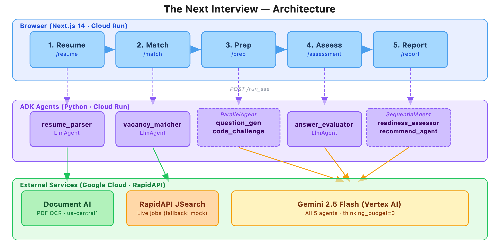

# The Next Interview

> AI-powered interview prep — from resume to readiness report in 5 steps, fully personalised to the candidate's skills and target role.

**Live:** https://the-next-interview-frontend-379802788252.us-central1.run.app


---

## What It Does

Upload a resume → get matched to live job listings → receive a personalised 15-question mock interview + coding challenge → submit answers for AI evaluation → get a scored readiness report with a study plan and course recommendations.

```
 ┌──────────┐     ┌──────────┐     ┌──────────┐     ┌──────────┐     ┌──────────┐
 │ 1 Resume │────▶│ 2 Match  │────▶│  3 Prep  │────▶│ 4 Assess │────▶│ 5 Report │
 └──────────┘     └──────────┘     └──────────┘     └──────────┘     └──────────┘
                                                            │                │
                                                            └────── retake ◀─┘
```

---

## Architecture



The browser calls each ADK agent independently over `POST /run_sse` (streaming). Session state is carried between steps via `localStorage`. No server-side pipeline runs at request time.

---

## Tech Stack

| Layer | Technology |
|-------|-----------|
| Frontend | Next.js 14 App Router, TypeScript strict |
| AI Agents | Google ADK, Python 3.11, 7 `LlmAgent` instances |
| LLM | Gemini 2.5 Flash via Vertex AI (`thinking_budget=0`) |
| PDF Parsing | Google Document AI OCR (raw PDF never hits the LLM) |
| Job Listings | RapidAPI JSearch — live listings, falls back to 23 mock vacancies |
| Deployment | Two Google Cloud Run services (agents + frontend) |
| Session Storage | Browser `localStorage` — 7-day TTL, no database |

---

## Security & Responsible AI

| Area | Approach |
|------|----------|
| **Resume privacy** | PDF → Document AI (OCR only) → plain text → Gemini. Raw bytes never enter the LLM. |
| **No data retention** | No database, no server-side storage. All session data lives in the user's own browser, auto-deleted after 7 days. |
| **No accounts** | Zero email or identity collected. Sessions use a random UUID generated client-side. |
| **API secrets** | Keys stored in Google Cloud Secret Manager — never in source control or the browser bundle. |
| **Non-decisional** | Platform helps candidates prepare only. Nothing is sent to employers. No hiring decision is made or influenced. |
| **Transparency** | Every score is explained — match summaries, per-answer feedback, and study plan reasoning are always shown. |
| **Human oversight** | All AI outputs are advisory. Users can retake assessments, regenerate questions, and discard any result. |
| **Known gaps** | No formal bias audit yet; course URLs generated from training data (may be outdated); no input content moderation. Planned for V2. |

---

## Quick Start

```bash
# 1 — Backend (ADK agents)
cd agents
cp .env.example .env        # add GOOGLE_API_KEY
pip install -e .
adk api_server --port 8000  # → http://localhost:8000/docs

# 2 — Frontend
cd frontend
npm install
npm run dev                 # → http://localhost:3000
```

Pick a mock profile → Match → Prep → Assess → Report.

---

## Docs

- [Agent Reference](./agents/README.md) — all 7 agents, inputs, outputs, and notes
- [Development & Deployment](./docs/DEVELOPMENT.md) — env vars, Cloud Run deploy, troubleshooting
