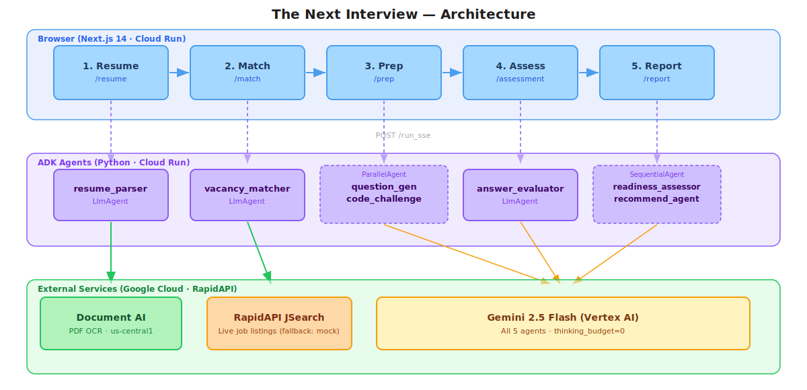

# The Next Interview

> AI-powered interview prep platform — from resume to readiness report in 5 steps, fully personalised to the candidate's skills and target role.

**Live:** https://the-next-interview-frontend-379802788252.us-central1.run.app


---

## What It Does

A candidate uploads (or picks) a resume. The platform matches it against live job listings (fetched via **RapidAPI JSearch**, falling back to 23 curated mock vacancies), generates a personalised 15-question mock interview and a coding challenge for the chosen role, evaluates the candidate's answers with AI feedback, and produces a scored readiness report with a study plan and course recommendations.

```
 ┌──────────┐     ┌──────────┐     ┌──────────┐     ┌──────────┐     ┌──────────┐
 │ 1 Resume │────▶│ 2 Match  │────▶│  3 Prep  │────▶│ 4 Assess │────▶│ 5 Report │
 └──────────┘     └──────────┘     └──────────┘     └──────────┘     └──────────┘
                                                            │                │
                                                            └────── retake ◀─┘
```

---

## Implemented Features

### ✅ Step 1 — Resume Upload (`/resume`)
- **PDF upload** — drag & drop or click, parsed by **Google Document AI OCR** (us-central1 regional endpoint, max 10 MB)
- **8 built-in mock profiles** — realistic candidate JSONs (names, roles, 2–8 years experience, full skill sets) — no upload needed
- Resume parsed into structured JSON by the `resume_parser` ADK agent and stored in ADK session state as `parsed_resume`
- Raw PDF stored as base64 in session state — never passed through the LLM
- Session ID returned → drives all downstream routes

### ✅ Step 2 — Job Match (`/match/[resumeId]`)
- **Live vacancies fetched via RapidAPI JSearch** and scored against the candidate's profile by `vacancy_matcher` — falls back to 23 curated mock vacancies if the API key is not set
- Each vacancy gets a **match % and fit level** (`strong_fit / good_fit / partial_fit / mismatch`)
- Per-card skill gap badges — shows exactly what's missing
- **Filter tabs**: All · Strong Fit · Good Fit · Partial Fit
- Results **cached in localStorage** per resume ID (avoids re-calling the agent on revisit)
- "Sorted by match score" label, mobile-responsive tab row with flex-wrap

### ✅ Step 3 — Interview Prep (`/prep/[vacancyId]`)
- **15 personalised interview questions** generated by `question_generator` based on the resume + chosen vacancy
- Questions organised by difficulty: Easy · Medium · Hard
- Each card shows: question text, focus area, hints, key points, and a model answer (revealed on demand)
- **1 coding / technical challenge** generated in parallel by `code_challenge` — includes problem statement, constraints, starter code, step-by-step solution, test cases, and common follow-up questions
- `ParallelAgent` runs both generators concurrently — halves wait time
- PrepSession cached in localStorage to restore on page reload

### ✅ Step 4 — Assessment (`/assessment/[sessionId]`)
- One-question-at-a-time answer interface with textarea
- Progress bar: "Answered X of 15"
- Each answer evaluated by `answer_evaluator` agent — returns per-answer score (0–100) and feedback paragraph
- Feedback shown inline immediately after submission — what was good, what was missing, how to improve
- All answers + evaluations stored in AssessmentSession (localStorage)
- Retake button — resets answers and starts fresh with the same questions

### ✅ Step 5 — Readiness Report (`/report/[sessionId]`)
- **Overall score 0–100** with animated horizontal score bars (Technical / Communication / Problem Solving)
- **Four verdicts:** `Strong Ready` · `Moderate Ready` · `Emerging` · `Developing`
- "What You Nailed" section — strength chips in green
- "Level Up Here" section — gap chips in orange
- **Learning Roadmap** — numbered priority timeline with colour-coded priority levels
- **Course Recommendations** — Udemy direct search links per weak topic, generated by `recommendation_agent`
- Q&A accordion — all 15 questions collapsed by default; each shows question number, mini score bar, AI feedback
- Course accordion — grouped by topic, first course open by default
- Footer CTA: Retake Assessment · Try Another Resume · Prep for Another Role

### ✅ Platform / UX
- **StepProgress** navigation bar — shows current step with visual indicators, previous steps clickable
- **Mobile responsive** — flex-wrap tabs, hidden overflow nav links, touch-friendly targets (≥36px)
- **Cold-start retry logic** — warmup ping on page load + automatic retry with "Agent warming up…" indicator if first request fails
- **Markdown rendering** — all agent-generated text (challenge description, step explanations, hints, key points) rendered via `react-markdown` — bold, lists, code blocks display correctly instead of raw `**stars**`
- **ErrorBoundary** component wraps pages to catch render-time crashes gracefully
- **Session TTL** — PrepSession and AssessmentSession auto-expire after 7 days
- Shared constants in `lib/constants.ts` — `ADK_BASE`, `CODING_LANGUAGES`, `SESSION_TTL_MS`
- Dark theme throughout — CSS custom properties for all colours
- TypeScript strict throughout frontend

---

## Architecture

### User Journey → Agent Mapping



### Key Design Decisions

| Decision | Why |
|---|---|
| **Frontend orchestrates agents** | Each agent is called independently by the browser — no server-side pipeline at runtime. The frontend carries state between steps via localStorage. |
| **ParallelAgent for Prep step** | `question_generator` and `code_challenge` run concurrently — halves wait time vs sequential |
| **SequentialAgent for Report step** | `recommendation_agent` needs `readiness_assessor`'s output — ADK session state passes it automatically |
| **`thinking_budget=0`** | Disables Gemini extended thinking — cuts latency from 60–180 s → 5–20 s per agent with no quality loss on structured JSON tasks |
| **Document AI for OCR** | PDF is never passed through the LLM — only the extracted text is. Prevents token overload and data leakage. |
| **RapidAPI JSearch** | Fetches real live vacancies at match time; falls back to bundled mock vacancies if API key is not set or request fails |
| **Cold-start warmup** | Frontend sends a silent ping to the ADK service on page load to pre-warm the Cloud Run container before the user clicks Generate |

---

## Agent Reference

All agents live in `agents/<name>/` and are standalone `LlmAgent` instances registered with ADK.
All use **Gemini 2.5 Flash** with `thinking_budget=0` (disables extended thinking — cuts latency from 60–180 s → 5–20 s per agent with no quality loss on structured JSON tasks).

### `resume_parser`
| | |
|---|---|
| **Type** | `LlmAgent` |
| **Input** | base64 PDF from ADK session state (`ToolContext.state["pdf_base64"]`) |
| **Tool** | `parse_resume_with_document_ai` — calls Document AI regional endpoint, returns extracted text |
| **Output key** | `parsed_resume` — structured JSON: `{ name, role, yearsExperience, skills[], experience[], education[] }` |
| **Notes** | PDF is never passed through the LLM prompt — only the OCR text output is. Prevents token overload and data leakage. |

### `vacancy_matcher`
| | |
|---|---|
| **Type** | `LlmAgent` |
| **Input** | Resume JSON in user message |
| **Output key** | `match_results` — `{ "results": [MatchResult, ...] }` |
| **What it does** | Loads all 23 vacancies from `data/vacancies/`, scores each against the resume (0–100%), assigns fit level, lists matched skills and missing skills per vacancy |
| **Cache** | Frontend caches results in `localStorage` per resume ID — avoids re-calling on revisit |

### `question_generator`
| | |
|---|---|
| **Type** | `LlmAgent` (inside `ParallelAgent`) |
| **Input** | Vacancy JSON + skill gaps |
| **Output key** | `generated_questions` — `{ "questions": [GeneratedQuestion, ...] }` |
| **What it does** | Generates exactly 15 questions split across `junior/mid/senior` difficulty, each with `focusArea`, `hint`, `keyPoints`, `modelAnswer` |

### `code_challenge`
| | |
|---|---|
| **Type** | `LlmAgent` (inside `ParallelAgent`) |
| **Input** | Vacancy JSON + primary programming language |
| **Output key** | `code_challenge` |
| **What it does** | Creates a realistic coding task for the role — `title`, `description`, `starterCode`, `solution` (with step-by-step, time/space complexity), `testCases`, `followUps` |
| **Notes** | Runs in parallel with `question_generator` via `ParallelAgent` — both finish together |

### `answer_evaluator`
| | |
|---|---|
| **Type** | `LlmAgent` |
| **Input** | All 15 questions + user's answers |
| **Output key** | `answer_evaluations` — `{ "evaluations": [AnswerEvaluation, ...] }` |
| **What it does** | Grades each answer: score (0–100), verdict (`excellent/good/partial/weak/missing`), 2–3 sentence feedback, missed concepts, suggested study topics |

### `readiness_assessor`
| | |
|---|---|
| **Type** | `LlmAgent` (first step of `SequentialAgent`) |
| **Input** | Evaluations summary + match score + missing skills |
| **Output key** | `readiness_report` |
| **What it does** | Synthesises everything into a final report: `overallScore`, `verdict`, `categoryScores` (Technical/Communication/Problem Solving), `strengths[]`, `weaknesses[]`, `studyPlan[]` |

### `recommendation_agent`
| | |
|---|---|
| **Type** | `LlmAgent` (second step of `SequentialAgent`) |
| **Input** | Readiness report from `readiness_assessor` (via ADK session state) |
| **Output key** | `course_recommendations` |
| **What it does** | For each weak area in the study plan, generates a list of specific Udemy courses with direct search URLs (`https://www.udemy.com/courses/search/?q=TOPIC`) |
| **Notes** | Runs automatically after `readiness_assessor` completes in the same `SequentialAgent` call |

---

## Frontend Pages

| Route | Component | Client State |
|-------|-----------|-------------|
| `/` | `page.tsx` | — |
| `/resume` | `ResumeUpload.tsx` | Creates ADK session, stores `resumeId` |
| `/match/[resumeId]` | `MatchClient.tsx` | Reads resume JSON, calls `vacancy_matcher`, caches in localStorage |
| `/prep/[vacancyId]` | `PrepClient.tsx` | Calls `ParallelAgent` (question_generator + code_challenge), stores `PrepSession` |
| `/assessment/[sessionId]` | `AssessmentClient.tsx` | Reads PrepSession, calls `answer_evaluator`, stores `AssessmentSession` |
| `/report/[sessionId]` | `ReportClient.tsx` | Reads AssessmentSession, calls `SequentialAgent` (readiness_assessor + recommendation_agent) |

---

## Repository Structure

```
the-next-interview/
├── Dockerfile                  # Agents container (Python ADK)
├── Dockerfile.frontend         # Frontend container (Next.js)
├── .dockerignore
│
├── agents/
│   ├── pyproject.toml          # google-adk, google-cloud-documentai, dependencies
│   ├── server.py               # Cloud Run entry point
│   ├── resume_parser/          # PDF OCR + structured JSON extraction
│   ├── vacancy_matcher/        # Score 23 jobs against resume
│   ├── question_generator/     # 15 personalised interview questions
│   ├── code_challenge/         # 1 role-appropriate coding task
│   ├── answer_evaluator/       # Grade free-text answers
│   ├── readiness_assessor/     # Final readiness report
│   ├── recommendation_agent/   # Udemy course links per weak area
│   ├── interview_system/       # Full SequentialAgent pipeline (alt entry)
│   │   └── agents/             # All agent definitions (also used standalone)
│   └── tools/
│       ├── document_ai_tools.py  # parse_resume_with_document_ai @tool
│       └── vacancy_tools.py      # load_all_vacancies @tool
│
├── data/
│   ├── resumes/                # 8 mock candidate JSON files
│   └── vacancies/              # 23 mock vacancy JSON files
│
└── frontend/
    ├── app/
    │   ├── layout.tsx           # Root layout, StepProgress nav
    │   ├── globals.css          # CSS custom properties, dark theme
    │   ├── page.tsx             # Landing page
    │   ├── resume/page.tsx      # Resume upload / mock profile picker
    │   ├── match/[resumeId]/    # Vacancy match results
    │   ├── prep/[vacancyId]/    # Questions + coding challenge tabs
    │   ├── assessment/[sessionId]/  # Answer interface
    │   └── report/[sessionId]/     # Readiness report
    ├── components/
    │   ├── ResumeUpload.tsx     # PDF upload + Document AI integration
    │   ├── StepProgress.tsx     # Top navigation progress bar
    │   ├── MatchClient.tsx      # Vacancy cards + filter tabs
    │   ├── PrepClient.tsx       # Question/challenge tab UI (markdown rendering, cold-start retry)
    │   ├── AssessmentClient.tsx # Answer textarea + per-Q feedback
    │   ├── ReportClient.tsx     # Score bars, verdict, roadmap, courses
    │   └── ErrorBoundary.tsx    # React error boundary for render-time crash recovery
    ├── lib/
    │   ├── constants.ts         # ADK_BASE, CODING_LANGUAGES, SESSION_TTL_MS
    │   ├── session.ts           # localStorage read/write helpers with 7-day TTL
    │   └── mock-data.ts         # Loads resume/vacancy JSON
    ├── data/                    # Mock resumes + vacancies (frontend copy)
    ├── types/                   # TypeScript interfaces
    └── cloudbuild.yaml          # Cloud Build config for frontend deploy
```

---

## Tech Stack Decisions

### Backend — Google ADK (Agent Development Kit)
We chose ADK over a plain LangChain/LLM setup because:
- **Native multi-agent support** — `SequentialAgent` and `ParallelAgent` let us chain and parallelise agents without custom orchestration code
- **Built-in session state** — ADK manages state between agents automatically via `stateDelta`; no Redis or DB needed for the pipeline
- **`adk api_server`** — gives us a FastAPI server with `/run` and `/run_sse` endpoints out of the box, zero boilerplate
- **Vertex AI integration** — one env var swap (`GOOGLE_GENAI_USE_VERTEXAI=TRUE`) moves from API key to production Vertex AI

### Model — Gemini 2.5 Flash with `thinking_budget=0`
- Flash is fast and cheap enough for 6 sequential agent calls per user flow
- `thinking_budget=0` disables Gemini's extended thinking mode — reduced response time from **60–180 s → ~5–20 s per agent** with no quality loss for structured JSON tasks
- Gemini Pro was originally used for `readiness_assessor` but caused timeouts; Flash handles it fine

### Document AI for Resume Parsing
- PDF OCR handled by Google Document AI (not the LLM) — avoids token overload and keeps raw PDF data out of model context
- Uses regional endpoint (`us-central1-documentai.googleapis.com`) via `ClientOptions` for lower latency
- Extracted text passed to `resume_parser` LlmAgent which structures it into the canonical resume JSON

### Frontend — Next.js 14 App Router
- Server components for data loading (resume/vacancy JSON files read at build/request time)
- Client components (`"use client"`) for all interactive state — matching, prep, assessment, report
- `localStorage` for session persistence — intentional for a hackathon-scale app; no auth needed
- TypeScript strict mode throughout

### Deployment — Google Cloud Run
- **Agents** and **Frontend** deployed as two separate Cloud Run services
- Agents need `--min-instances=1 --timeout=300` — cold starts add 10–15 s and agent calls can run up to 2 minutes
- `NEXT_PUBLIC_ADK_URL` is baked into the Next.js JS bundle at **build time** — must be passed via `--substitutions` during Cloud Build, not as a runtime env var

---

## Session Flow (localStorage)

The frontend uses three localStorage slots:

| Key | Type | Contents |
|-----|------|----------|
| `tni_prep_session` | `PrepSession` | Current vacancy, match result, generated questions, code challenge |
| `tni_assessment_session` | `AssessmentSession` | All answers, evaluations, final readiness report |
| `tni_match_<resumeId>` | `MatchResult[]` | Cached match results per resume (24 h TTL) |

**Critical isolation rules** (bugs we fixed):
- `PrepClient` only restores cached questions if `session.vacancyId === vacancy.id`
- `AssessmentClient` only redirects to report if `assessment.prepSessionId === sessionId` (URL param)
- `ReportClient` only loads stored report if `assessment.sessionId === sessionId` (URL param)
- ADK session IDs use `crypto.randomUUID()` / `nanoid()` — no collisions on retry

---

## ADK Response Parsing Pattern

ADK's `stateDelta` values can be either an already-parsed JS object or a raw JSON string (when the agent returns markdown-wrapped JSON like ` ```json ... ``` `). All frontend client components handle both:

```typescript
const rawData = event?.actions?.stateDelta?.some_key

if (typeof rawData === 'object' && rawData !== null && 'expectedField' in rawData) {
  result = rawData   // Already parsed — use directly
} else {
  const str = typeof rawData === 'string' ? rawData : JSON.stringify(rawData)
  try {
    result = JSON.parse(str)
  } catch {
    // Regex fallback for markdown-wrapped JSON
    const m = str.match(/\{[\s\S]*"expectedField"[\s\S]*\}/)
    if (m) result = JSON.parse(m[0])
  }
}

// Final fallback: content.parts text
if (!result) {
  const text = event?.content?.parts?.findLast(p => p.text)?.text ?? ''
  const m = text.match(/\{[\s\S]*"expectedField"[\s\S]*\}/)
  if (m) result = JSON.parse(m[0])
}

// Never silent — if all parsing fails, throw
if (!result) throw new Error('Agent returned unparseable response')
```

---

## Local Development

### Prerequisites
- Python 3.11+
- Node.js 20+
- `pip install google-adk google-cloud-documentai`
- Google AI Studio API key → https://aistudio.google.com/apikey
- (Optional for Document AI) Google Cloud project with Document AI API enabled

### 1. Start the ADK agents backend

```bash
cd agents
cp .env.example .env
# Edit .env — set GOOGLE_API_KEY (and optionally DOCUMENT_AI_PROCESSOR_ID)
pip install -e .
adk api_server --port 8000
# Swagger UI: http://localhost:8000/docs
```

### 2. Start the Next.js frontend

```bash
cd frontend
cp .env.example .env.local
# .env.local already points to http://localhost:8000
npm install
npm run dev
# App: http://localhost:3000
```

### 3. Verify the flow

1. Open http://localhost:3000
2. Pick a mock profile (e.g. "Sri Balaji")
3. Click "Find Live Matches" — expect vacancy cards with % scores in ~10–30 s
4. Pick a vacancy → click "Generate Prep Material"
5. Answer questions → Submit All → view Report

---

## Deployment (Google Cloud)

### Prerequisites
- `gcloud` CLI authenticated
- Artifact Registry repo: `us-central1-docker.pkg.dev/thesimplifiedtech/the-next-interview/`

### Deploy Agents

```bash
# From project root — builds and pushes the agents image
gcloud builds submit . \
  --tag us-central1-docker.pkg.dev/thesimplifiedtech/the-next-interview/agents:latest

# Deploy to Cloud Run
gcloud run deploy the-next-interview-agents \
  --image us-central1-docker.pkg.dev/thesimplifiedtech/the-next-interview/agents:latest \
  --region us-central1 \
  --platform managed \
  --allow-unauthenticated \
  --min-instances=1 \
  --timeout=300 \
  --set-env-vars GOOGLE_GENAI_USE_VERTEXAI=TRUE,GOOGLE_CLOUD_PROJECT=thesimplifiedtech,GOOGLE_CLOUD_LOCATION=us-central1
```

### Deploy Frontend

```bash
# From the frontend/ directory — agents URL is auto-discovered, no hardcoding needed
cd frontend
gcloud builds submit . --config cloudbuild.yaml

# Deploy
gcloud run deploy the-next-interview-frontend \
  --image us-central1-docker.pkg.dev/thesimplifiedtech/the-next-interview/frontend:latest \
  --region us-central1 \
  --platform managed \
  --allow-unauthenticated
```

> **Why no `--substitutions`?** `cloudbuild.yaml` now has a first step that runs `gcloud run services describe` to fetch the agents URL dynamically at build time — nothing is hardcoded in source control. `NEXT_PUBLIC_` variables are baked into the Next.js JS bundle during `docker build`, so they still can't be set as Cloud Run runtime env vars.

---

## Environment Variables

### Agents (`agents/.env`)

```bash
# Option A: Google AI Studio (local dev / hackathon)
GOOGLE_API_KEY=your_key_here

# Option B: Vertex AI (production — recommended)
GOOGLE_GENAI_USE_VERTEXAI=TRUE
GOOGLE_CLOUD_PROJECT=thesimplifiedtech
GOOGLE_CLOUD_LOCATION=us-central1

# Document AI (for resume_parser agent)
DOCUMENT_AI_PROCESSOR_ID=your_processor_id
DOCUMENT_AI_LOCATION=us-central1
```

### Frontend (`frontend/.env.local`)

```bash
# Local dev — points to adk api_server running on port 8000
NEXT_PUBLIC_ADK_URL=http://localhost:8000
```

In production this is set via `--substitutions=_ADK_URL=...` during Cloud Build — not an `.env` file.

---

## Troubleshooting

| Problem | Cause | Fix |
|---------|-------|-----|
| `Failed to fetch` on match page | Wrong `NEXT_PUBLIC_ADK_URL` baked in at build time | Rebuild frontend with correct agents URL in `--substitutions` |
| `409 Conflict` from ADK | Reusing the same session ID on retry | All session IDs use `crypto.randomUUID()` — already handled; if persists, clear localStorage |
| `Cannot read properties of undefined` on report page | Agent returned unexpected `verdict` or `priority` string | `getVerdictConfig()` in `ReportClient.tsx` has a fallback — check if normalizer covers the new string |
| 0 vacancy cards shown | Agent returned empty on cold start | Error + Retry button shown; click retry. Set `--min-instances=1` to avoid cold starts |
| Challenge fails on first click, works second time | Cloud Run cold start — first request arrives before container is warm | Fixed: warmup ping sent on prep page load; both `generateQuestions` and `generateChallenge` auto-retry once with "Agent warming up…" message |
| Challenge text showing `**bold**` or `- bullets` as raw text | No markdown renderer | Fixed: `react-markdown` renders all agent-generated text fields in PrepClient |
| "No report found" on report page | `assessment.sessionId !== sessionId` mismatch (old URL) | Complete a fresh assessment — don't navigate directly to old report URLs |
| Agents taking 60+ seconds | `thinking_budget` not set to 0 | All agents must have `config=GenerateContentConfig(thinking_config=ThinkingConfig(thinking_budget=0))` — check each agent file |
| Document AI `404` | Wrong processor ID or wrong regional endpoint | Use `ClientOptions(api_endpoint="us-central1-documentai.googleapis.com")` and verify processor ID in Cloud Console |
| Resume upload returns empty parsed JSON | Document AI OCR returned no text (scanned image PDF, not text-based) | Ensure the uploaded PDF has selectable text; image-only PDFs require Form Parser processor |

---

## Data

### Mock Resumes (`data/resumes/`)

| File | Candidate | Role | Years |
|------|-----------|------|-------|
| `java-dev-3yr.json` | Alex Chen | Java Developer | 3 |
| `python-ml-5yr.json` | Priya Sharma | ML Engineer | 5 |
| `devops-2yr.json` | Marcus Lee | DevOps Engineer | 2 |
| `fullstack-react-4yr.json` | Sofia Novak | Full-Stack Developer | 4 |
| `cloud-architect-8yr.json` | James Okafor | Cloud Architect | 8 |
| `database-engineer-elena-6yr.json` | Elena Vasquez | Database Engineer | 6 |
| `java-dev-sarah-5yr.json` | Sarah Kim | Java Developer | 5 |
| `kubernetes-engineer-marcus-5yr.json` | Marcus Johnson | Kubernetes Engineer | 5 |

### Mock Vacancies (`data/vacancies/`)

23 roles across fintech, healthtech, SaaS, big-tech, and startups — covering Java, Python, Go, TypeScript, DevOps, ML, Cloud, Android, Security, and Data Engineering.
